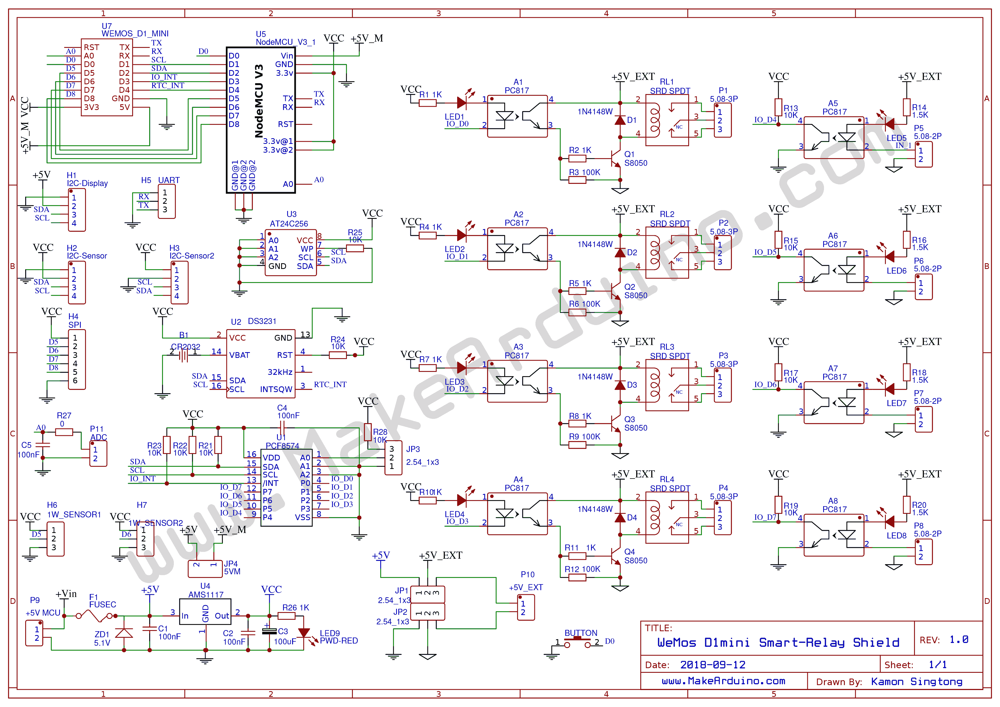

# ESP8266_SmartRelayShield
Example code for MakeArduino-ESP8266 Smart-Relay Shield

<b>Edit all user config in "config.h"</b>
---
<h3>Serial Command:</h3>
<ul>
<li> D yyyy-mm-dd hh:mm:ss         -> Set Clock to RTC</li>
<li> T HH:mm:ss                    -> Set Time to RTC</li>
<li> A S ss                        -> Set Alarm to Toggle Relay 1 (alarm when Second matched)</li>
<li> A M mm:ss                     -> Set Alarm to Toggle Relay 1 (alarm when Minute and Second matched)</li>
<li> A H hh:mm:ss                  -> Set Alarm to Toggle Relay 1 (alarm when match all Hour,Minute and Second)</li>
</ul>

<h2>Blynk Example</h2>

<h2>Board Schematic</h1>

